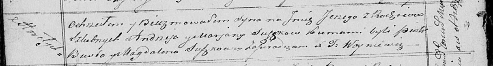

**Сушко Юрий Андреев (Suszko Jerzy)**

29 января 1821 г -- крещение (НИАБ 136-13-894, лист 105об, №2/1821-р
(ориг)).

**НИАБ 136-13-894:** Лист 105об. **Метрическая запись №2/1821-р
(ориг).**

Осовская Покровская церковь. 29 января 1821 года. Метрическая запись о
крещении.

Suszko Jerzy -- сын родителей с деревни Горелое.

Suszko Andrzey -- отец.

Suszkowa Marjana -- мать.

Busło Piotr -- кум.

Suszkowa Magdalena -- кума.

Woyniewicz Tomasz -- ксёндз.
