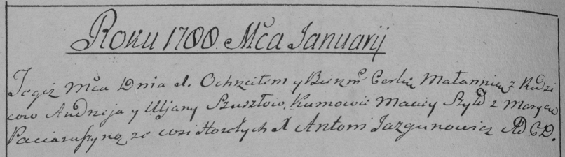

**Сушко Андрей (Suszko Andrzey)**

9 мая 1785 г -- крещение дочери Евы (РГИА 823-12-18, лист 229,
№13/1785-р (коп)).

1 января 1788 г -- крещение дочери Мелании (НИАБ 136-13-894, лист 3об,
№1/1788-р (ориг)), (РГИА 823-2-18, лист 235об, №1/1788-р (коп)).

9 марта 1790 г -- крещение дочери Настасья (НИАБ 136-13-894, лист 9,
№16/1790-р (ориг)), (РГИА 823-2-18, лист 239об, №9/1790-р (коп)).

**РГИА 823-2-18:** Лист 229. **Метрическая запись №13/1785-р (коп).**

{width="6.496527777777778in"
height="2.2256944444444446in"}

Дедиловичская Покровская церковь. 9 мая 1785 года. Метрическая запись о
крещении.

Suszkowna Ewa -- дочь родителей с деревни Горелое.

Suszko Andrzey -- отец.

Suszkowa Uljana -- мать.

Suszko Chama -- кум.

Par\...uszyna Maryna - кума.

Jazgunowicz Antoni -- ксёндз.

**НИАБ 136-13-894:** Лист 3об. **Метрическая запись №1/1788-р (ориг).**

{width="6.496527777777778in"
height="1.1941699475065617in"}

Дедиловичская Покровская церковь. 1 января 1788 года. Метрическая запись
о крещении.

Suszkowna Małania -- дочь родителей с деревни Горелое.

Suszko Andrzej -- отец.

Suszkowa Ullana -- мать.

Szyło Maciey - кум.

Paciaruszyna Maryna - кума.

Jazgunowicz Antoniusz -- ксёндз.

**РГИА 823-2-18:** Лист 235об. **Метрическая запись №1/1788-р (коп).**

{width="6.496527777777778in"
height="1.8138888888888889in"}

Дедиловичская Покровская церковь. 1 января 1788 года. Метрическая запись
о крещении.

Szuszkowna Małannia -- дочь родителей с деревни Горелое.

Szuszko Andrzey -- отец.

Szuszkowa Uljana -- мать.

Szyło Maciey -- кум.

Paciaruszyna Marya - кума.

Jazgunowicz Antoni -- ксёндз.

**НИАБ 136-13-894:** Лист 9. **Метрическая запись №16/1790-р (ориг).**

{width="6.496527777777778in"
height="0.8508716097987752in"}

Дедиловичская Покровская церковь. 9 марта 1790 года. Метрическая запись
о крещении.

Suszkowna Nastazya -- дочь родителей с деревни Горелое.

Suszko Andrzey -- отец.

Suszkowa Ullana -- мать.

Suszko Choma - кум.

Paciaruchowa Maryna - кума.

Jazgunowicz Antonij -- ксёндз.

**РГИА 823-2-18:** Лист 239об. **Метрическая запись №9/1790-р (коп).**

{width="6.496527777777778in"
height="2.011111111111111in"}

Дедиловичская Покровская церковь. 9 марта 1790 года. Метрическая запись
о крещении.

Suszkowna Nastazia -- дочь родителей с деревни Горелое.

Suszko Andrzey -- отец.

Suszko Uljana -- мать.

Suszko Chama -- кум.

Paciaruchowa Marjanna - кума.

Jazgunowicz Antoni -- ксёндз.
