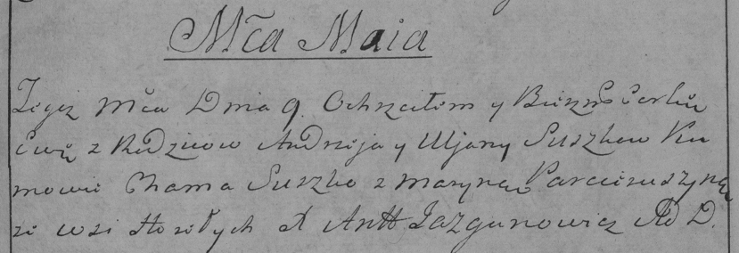

**Сушко Ева Андреева (Suszkowna Ewa)**

9 мая 1785 г -- крещение дочери Евы (РГИА 823-12-18, лист 229,
№13/1785-р (коп)).

**РГИА 823-2-18:** Лист 229. **Метрическая запись №13/1785-р (коп).**

{width="6.496527777777778in"
height="2.2256944444444446in"}

Дедиловичская Покровская церковь. 9 мая 1785 года. Метрическая запись о
крещении.

Suszkowna Ewa -- дочь родителей с деревни Горелое.

Suszko Andrzey -- отец.

Suszkowa Uljana -- мать.

Suszko Chama -- кум.

Par\...uszyna Maryna - кума.

Jazgunowicz Antoni -- ксёндз.
