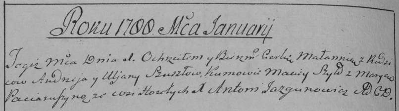

**Сушко Мелания Андреева (Suszkowna Małania)**

1 января 1788 г -- крещение (НИАБ 136-13-894, лист 3об, №1/1788-р
(ориг)), (РГИА 823-2-18, лист 235об, №1/1788-р (коп)).

**НИАБ 136-13-894:** Лист 3об. **Метрическая запись №1/1788-р (ориг).**

{width="6.496527777777778in"
height="1.1941699475065617in"}

Дедиловичская Покровская церковь. 1 января 1788 года. Метрическая запись
о крещении.

Suszkowna Małania -- дочь родителей с деревни Горелое.

Suszko Andrzej -- отец.

Suszkowa Ullana -- мать.

Szyło Maciey - кум.

Paciaruszyna Maryna - кума.

Jazgunowicz Antoniusz -- ксёндз.

**РГИА 823-2-18:** Лист 235об. **Метрическая запись №1/1788-р (коп).**

{width="6.496527777777778in"
height="1.8138888888888889in"}

Дедиловичская Покровская церковь. 1 января 1788 года. Метрическая запись
о крещении.

Szuszkowna Małannia -- дочь родителей с деревни Горелое.

Szuszko Andrzey -- отец.

Szuszkowa Uljana -- мать.

Szyło Maciey -- кум.

Paciaruszyna Marya - кума.

Jazgunowicz Antoni -- ксёндз.
