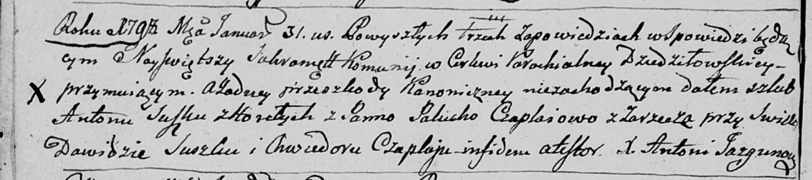
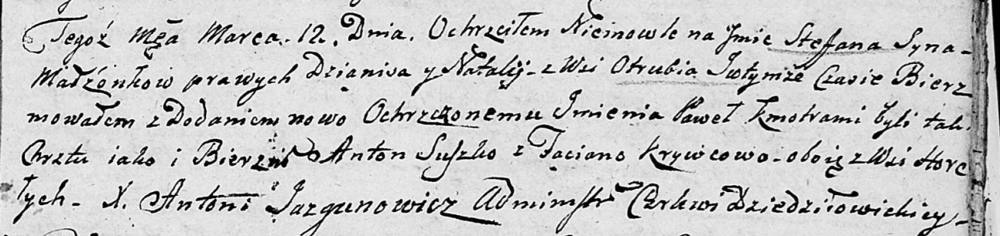
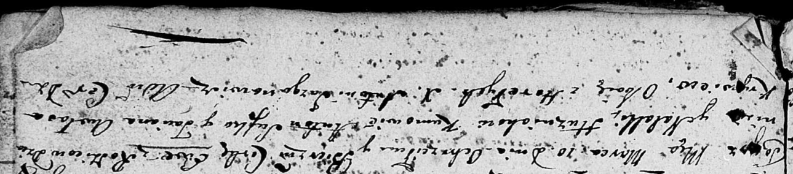

**Сушко Антон (Suszko Anton)**

31 января 1798 г -- венчание с Палюхой Чапляй с деревни Заречье (НИАБ
136-13-920, лист 5об, №5/1798-б (ориг)).

26 декабря 1798 г -- крещение сына Степана (НИАБ 136-13-894, лист 37об,
№62/1798-р (ориг)), (РГИА 823-2-18, лист 267, №62/1798-р (коп)).

25 июля 1804 г -- крещение дочери Текли Марты (НИАБ 136-13-894, лист 54,
№26/1804-р (ориг)).

12 марта 1805 г -- крестный отец Стефана Павла, сына Гузняков Дзяниса и
Натальи с деревни Отруб (НИАБ 136-13-894, лист 57, №19/1805-р (ориг)).

10 марта 1807 г -- крестный отец Евы, дочери Гузняков Дзяниса и Натальи
с деревни Клинники (НИАБ 136-13-894, лист 62, №16/1807-р (ориг)).

**НИАБ 136-13-920:** Лист 5об. **Метрическая запись №5/1798-б (ориг).**

Дедиловичская Покровская церковь. 31 января 1798 года. Метрическая
запись о венчании.

Suszko Anton -- жених, деревня Горелое.

Czaplajowa Palucha -- невеста, деревня Заречье.

Suszko Dawid -- свидетель.

Czaplay Chwiedor -- свидетель.

Jazgunowicz Antoni -- ксёндз.

**НИАБ 136-13-894:** Лист 37об. **Метрическая запись №62/1798-р
(ориг).**

Дедиловичская Покровская церковь. 26 декабря 1798 года. Метрическая
запись о крещении.

Suszko Stefan -- сын родителей с деревни Горелое.

Suszko Antoni -- отец.

Suszkowa Pałanieja -- мать.

Suszko Karp - кум.

Suszkowa Ewdokija - кума.

Jazgunowicz Antoni -- ксёндз.

**РГИА 823-2-18:** Лист 267. **Метрическая запись №63/1798-р (коп).**

Дедиловичская Покровская церковь. 26 декабря 1798 года. Метрическая
запись о крещении.

Suszko Stefan -- сын родителей с деревни Горелое.

Suszko Antoni -- отец.

Suszkowa Pałanieja -- мать.

Suszko Karp -- кум.

Suszkowa Eudokia -- кума.

Jazgunowicz Antoni -- ксёндз.

**НИАБ 136-13-894:** Лист 54. **Метрическая запись №26/1804-р (ориг).**

Дедиловичская Покровская церковь. 25 июля 1804 года. Метрическая запись
о крещении.

Suszkowna Tekla Marta -- дочь \[родителей с деревни Горелое\].

Suszko Anton -- отец.

Suszkowa Pałanieja -- мать.

Suszko Karp -- кум, с деревни Горелое.

Suszkowa Ewdokija -- кума.

Jazgunowicz Antoni -- ксёндз.

**НИАБ 136-13-894:** Лист 57. **Метрическая запись №19/1805-р (ориг).**

Дедиловичская Покровская церковь. 12 марта 1805 года. Метрическая запись
о крещении.

\[Huzniak\] Stefan Paweł -- сын родителей с деревни Отруб.

\[Huzniak\] Dzianis -- отец.

\[Huzniakowa\] Natalja -- мать.

Suszko Anton -- кум, с деревни Горелое.

Krywcowa Taciana -- кума, с деревни Горелое.

Jazgunowicz Antoni -- ксёндз.

**НИАБ 136-13-894:** Лист 62. **Метрическая запись №16/1807-р (ориг).**

Дедиловичская Покровская церковь. 10 марта 1807 года. Метрическая запись
о крещении.

Huzniakowna Ewa -- дочь родителей с деревни \[Клинники\].

Huzniak Dzianis -- отец.

Huzniakowa Natalla -- мать.

Suszko Anton -- кум, с деревни Горелое.

Krywcowa Awłasa Taciana -- кума, с деревни Горелое.

Jazgunowicz Antoni -- ксёндз.
