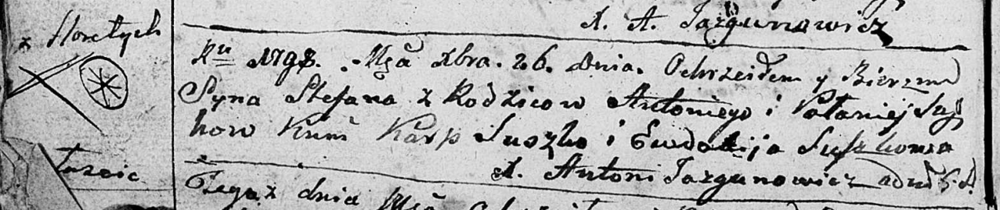
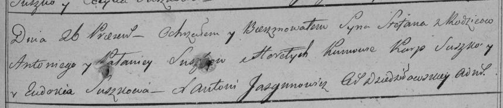

**Сушко Степан Антонов (Suszko Stefan)**

26 декабря 1798 г -- крещение (НИАБ 136-13-894, лист 37об, №62/1798-р
(ориг)), (РГИА 823-2-18, лист 267, №62/1798-р (коп)).

**НИАБ 136-13-894:** Лист 37об. **Метрическая запись №62/1798-р
(ориг).**

Дедиловичская Покровская церковь. 26 декабря 1798 года. Метрическая
запись о крещении.

Suszko Stefan -- сын родителей с деревни Горелое.

Suszko Antoni -- отец.

Suszkowa Pałanieja -- мать.

Suszko Karp - кум.

Suszkowa Ewdokija - кума.

Jazgunowicz Antoni -- ксёндз.

**РГИА 823-2-18:** Лист 267. **Метрическая запись №63/1798-р (коп).**

Дедиловичская Покровская церковь. 26 декабря 1798 года. Метрическая
запись о крещении.

Suszko Stefan -- сын родителей с деревни Горелое.

Suszko Antoni -- отец.

Suszkowa Pałanieja -- мать.

Suszko Karp -- кум.

Suszkowa Eudokia -- кума.

Jazgunowicz Antoni -- ксёндз.
