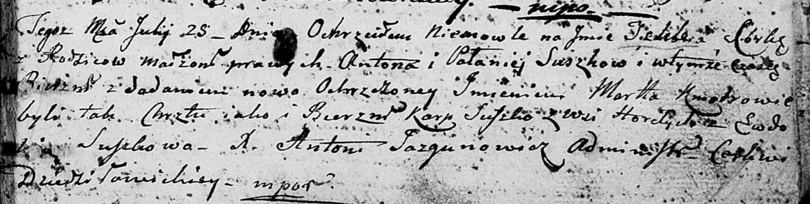

**Сушко Текля Антонова (Suszkowna Tekla Marta)**

25 июля 1804 г -- крещение (НИАБ 136-13-894, лист 54, №26/1804-р
(ориг)).

**НИАБ 136-13-894:** Лист 54. **Метрическая запись №26/1804-р (ориг).**

{width="6.496527777777778in"
height="1.6407272528433945in"}

Дедиловичская Покровская церковь. 25 июля 1804 года. Метрическая запись
о крещении.

Suszkowna Tekla Marta -- дочь \[родителей с деревни Горелое\].

Suszko Anton -- отец.

Suszkowa Pałanieja -- мать.

Suszko Karp -- кум, с деревни Горелое.

Suszkowa Ewdokija -- кума.

Jazgunowicz Antoni -- ксёндз.
