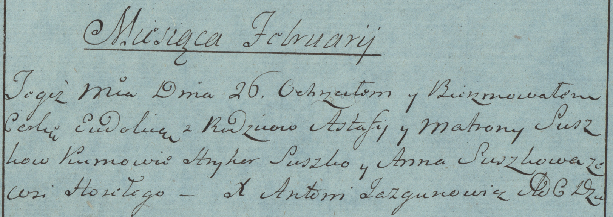

**Сушко Матрона (Suszko Matrona)**

26 февраля 1783 г -- крещение дочери Евдокии (РГИА 823-2-18, лист 223об,
№4/1783-р (коп)).

**РГИА 823-2-18:** Лист 223об. **Метрическая запись №4/1783-р (коп).**

{width="6.496527777777778in"
height="2.3097222222222222in"}

Дедиловичская Покровская церковь. 26 февраля 1783 года. Метрическая
запись о крещении.

Suszkowna Eudokia -- дочь родителей с деревни Горелое.

Suszko Astafi -- отец.

Suszkowa Matrona -- мать.

Suszko Hryhor -- кум.

Suszkowa Anna - кума.

Jazgunowicz Antoni -- ксёндз.
