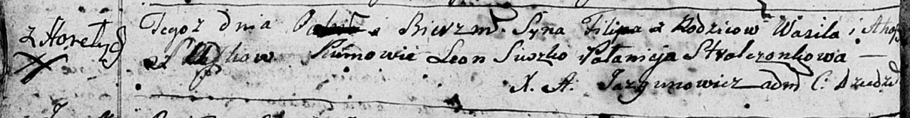
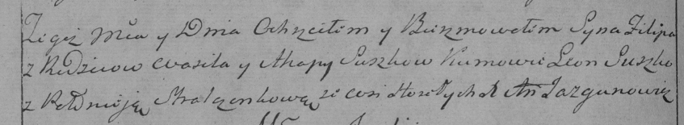

**Сушко Пилип Василев (Suszko Filip)**

8 июня 1796 г -- крещение (НИАБ 136-13-894, лист 29об, №62/1796-р
(ориг)), (РГИА 823-2-18, лист 256об, №34/1796-р (коп)).

**НИАБ 136-13-894:** Лист 29-об. **Метрическая запись №62/1796-р
(ориг).**

Дедиловичская Покровская церковь. 8 июня 1796 года. Метрическая запись о
крещении.

Suszko Filip -- сын родителей с деревни Горелое.

Suszko Wasil -- отец.

Suszkowa Ahapa -- мать.

Suszko Leon - кум.

Stralczonkowa Pałanieja - кума.

Jazgunowicz Antoni -- ксёндз.

**РГИА 823-2-18:** Лист 256об. **Метрическая запись №34/1796-р (коп).**

Дедиловичская Покровская церковь. \[8\] июня 1796 года. Метрическая
запись о крещении.

Suszko Filip -- сын родителей с деревни Горелое.

Suszko Wasil -- отец.

Suszkowa Ahapa -- мать.

Suszko Leon -- кум.

Stralczonkowa Pałanieja -- кума.

Jazgunowicz Antoni -- ксёндз.
