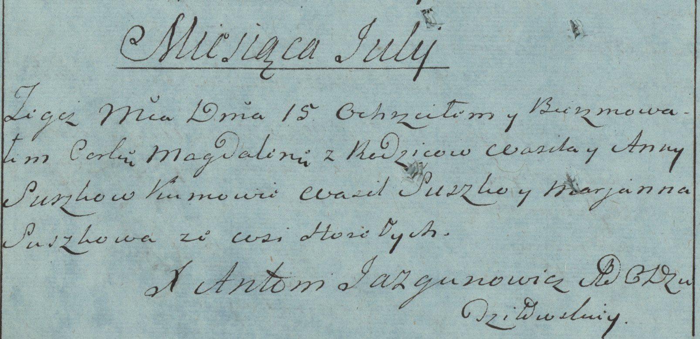
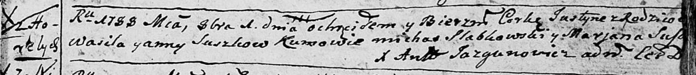

**Сушко Василь (Suszko Wasil)**

26 февраля 1783 г -- крещение дочери Магдалены (РГИА 823-2-18, лист
226об, №13/1784-р (коп)).

1 октября 1788 г -- крещение дочери Юстыны (НИАБ 136-13-894, лист 5,
№52/1788-р (ориг)).

6 февраля 1793 г -- крещение дочери Евдокии (НИАБ 136-13-894, лист 18об,
№15/1793-р (ориг)).

**РГИА 823-2-18:** Лист 226об. **Метрическая запись №13/1784-р (коп).**

Дедиловичская Покровская церковь. 15 июля 1784 года. Метрическая запись
о крещении.

Suszkowna Magdalena -- дочь родителей с деревни Горелое.

Suszko Wasil -- отец.

Suszkowa Anna -- мать.

Suszko Wasil -- кум.

Suszkowa Marjanna - кума.

Jazgunowicz Antoni -- ксёндз.

**НИАБ 136-13-894:** Лист 5. **Метрическая запись №52/1788-р (ориг).**

Дедиловичская Покровская церковь. 1 октября 1788 года. Метрическая
запись о крещении.

Suszkowna Justyna -- дочь родителей с деревни Горелое.

Suszko Wasil -- отец.

Suszkowa Anna -- мать.

Słabkowski Michaś - кум.

Suszkowa Marjana - кума.

Jazgunowicz Antoni -- ксёндз.

**НИАБ 136-13-894:** Лист 18-об. **Метрическая запись №15/1793-р
(ориг).**

Дедиловичская Покровская церковь. 6 февраля 1793 года. Метрическая
запись о крещении.

Suszkowna Ewdokija -- дочь родителей с деревни Горелое.

Suszko Wasil -- отец.

Suszkowa Anna -- мать.

Suszko Wasil - кум.

Suszkowa Marjana - кума.

Jazgunowicz Antoni -- ксёндз.
