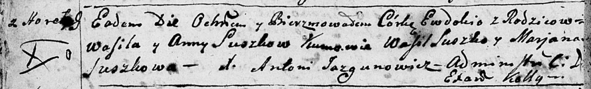

**Сушко Евдокия Васильева (Suszkowna Ewdokija)**

6 февраля 1793 г -- крещение (НИАБ 136-13-894, лист 18об, №15/1793-р
(ориг)).

**НИАБ 136-13-894:** Лист 18-об. **Метрическая запись №15/1793-р
(ориг).**

Дедиловичская Покровская церковь. 6 февраля 1793 года. Метрическая
запись о крещении.

Suszkowna Ewdokija -- дочь родителей с деревни Горелое.

Suszko Wasil -- отец.

Suszkowa Anna -- мать.

Suszko Wasil - кум.

Suszkowa Marjana - кума.

Jazgunowicz Antoni -- ксёндз.
