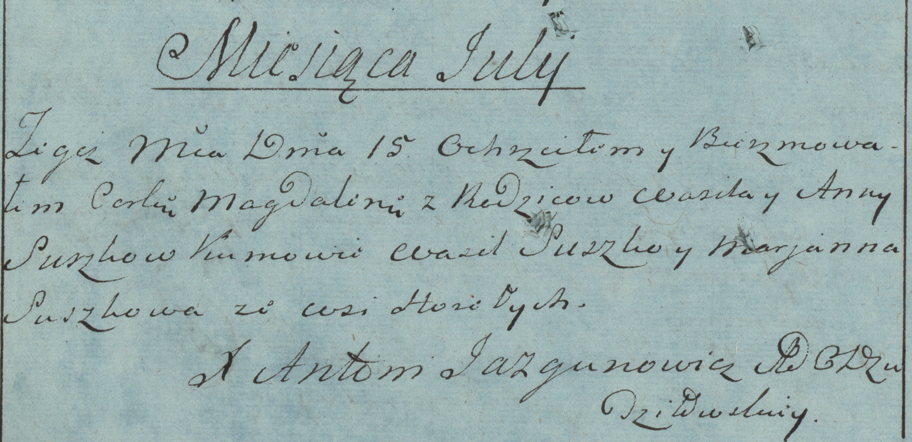

**Сушко Магдалена Васильева (Suszkowna Magdalena)**

26 февраля 1783 г -- крещение (РГИА 823-2-18, лист 226об, №13/1784-р
(коп)).

**РГИА 823-2-18:** Лист 226об. **Метрическая запись №13/1784-р (коп).**

Дедиловичская Покровская церковь. 15 июля 1784 года. Метрическая запись
о крещении.

Suszkowna Magdalena -- дочь родителей с деревни Горелое.

Suszko Wasil -- отец.

Suszkowa Anna -- мать.

Suszko Wasil -- кум.

Suszkowa Marjanna - кума.

Jazgunowicz Antoni -- ксёндз.
