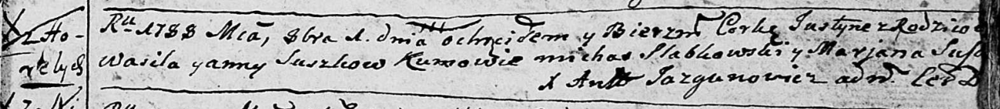

**Сушко Юстына Васильева (Suszkowna Justyna)**

1 октября 1788 г -- крещение (НИАБ 136-13-894, лист 5, №52/1788-р
(ориг)).

Лист 5. **Метрическая запись №52/1788-р (ориг).**

{width="6.496527777777778in"
height="0.7140879265091864in"}

Дедиловичская Покровская церковь. 1 октября 1788 года. Метрическая
запись о крещении.

Suszkowna Justyna -- дочь родителей с деревни Горелое.

Suszko Wasil -- отец.

Suszkowa Anna -- мать.

Słabkowski Michaś - кум.

Suszkowa Marjana - кума.

Jazgunowicz Antoni -- ксёндз.
