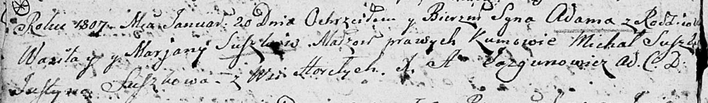

**Сушко, Адам Василев (Suszko Adam)**

20 января 1806 г -- крещение (НИАБ 136-13-894, лист 61об, №2/1806-р
(ориг)).

**НИАБ 136-13-894:** Лист 61об. **Метрическая запись №2/1807-р (ориг).**

Дедиловичская Покровская церковь. 20 января 1807 года. Метрическая
запись о крещении.

Suszko Adam -- сын родителей с деревни Горелое.

Suszko Wasil -- отец.

Suszkowa Marjana -- мать.

Suszko Michał -- кум.

Suszkowa Justyna -- кума.

Jazgunowicz Antoni -- ксёндз.
