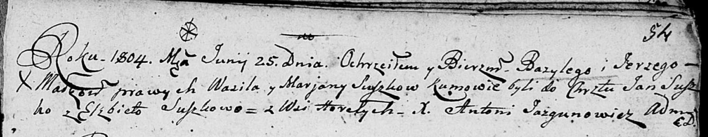

**Сушко Базыль Василев (Suszko Bazyli Jerzy)**

25 июня 1804 г -- крещение (НИАБ 136-13-894, лист 54, №18/1804-р
(ориг)).

**НИАБ 136-13-894:** Лист 54. **Метрическая запись №18/1804-р (ориг).**

{width="6.496527777777778in"
height="1.2665846456692913in"}

Дедиловичская Покровская церковь. 25 июня 1804 года. Метрическая запись
о крещении.

Suszko Bazyli Jerzy -- сын родителей с деревни Горелое.

Suszko Wasil -- отец.

Suszkowa Marjana -- мать.

Suszko Jan -- кум.

Suszkowa Elżbieta -- кума.

Jazgunowicz Antoni -- ксёндз.
