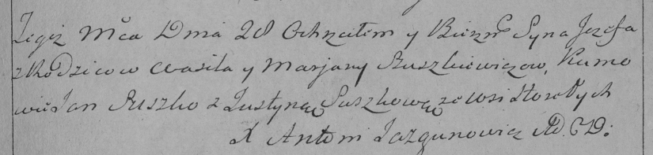

**Сушко, Шушкевич Иосиф Василев (Szuszkiewicz Jozef)**

28 декабря 1792 г -- крещение (НИАБ 136-13-894, лист 18, №88/1792-р
(ориг)), (РГИА 823-2-18, лист 246, №40/1792-р (коп)).

**НИАБ 136-13-894:** Лист 18. **Метрическая запись №88/1792-р (ориг).**

Дедиловичская Покровская церковь. 28 декабря 1792 года. Метрическая
запись о крещении.

Szuszkiewicz Jozef -- сын родителей с деревни Горелое.

Szuszkiewicz Wasil -- отец.

Szuszkiewiczowa Maryna -- мать.

Suszko Jan - кум.

Szuszkowa Justyna - кума.

Jazgunowicz Antoni -- ксёндз.

**РГИА 823-2-18:** Лист 246. **Метрическая запись №40/1792-р (коп).**

Дедиловичская Покровская церковь. 28 декабря 1792 года. Метрическая
запись о крещении.

Szuszkiewicz Jezef -- сын родителей с деревни Горелое.

Szuszkiewicz Wasil -- отец.

Szuszkiewiczowa Marjana -- мать.

Suszko Jan -- кум.

Suszkowa Justyna -- кума.

Jazgunowicz Antoni -- ксёндз.
