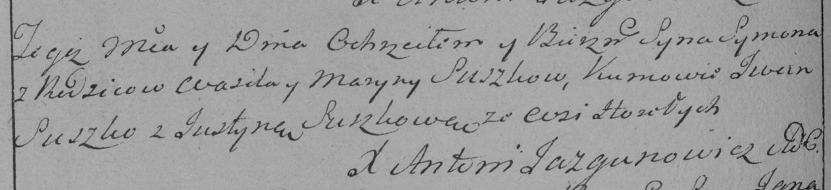

**Сушко Сымон Василев (Suszko Symon)**

7 сентября 1791 г -- крещение (НИАБ 136-13-894, лист 13об, №42/1791-р
(ориг)), (РГИА 823-2-18, лист 242, №21/1791-р (коп)).

**НИАБ 136-13-894:** Лист 13об. **Метрическая запись №42/1791-р
(ориг).**

{width="6.496527777777778in"
height="1.0010651793525809in"}

Дедиловичская Покровская церковь. 7 сентября 1791 года. Метрическая
запись о крещении.

Suszko Symon -- сын родителей с деревни Горелое.

Suszko Wasil -- отец.

Suszkowa Maryna -- мать.

Suszko Jwan - кум.

Suszkowa Justyna - кума.

Jazgunowicz Antoni -- ксёндз.

**РГИА 823-2-18:** Лист 242об. **Метрическая запись №21/1791-р (коп).**

{width="6.496527777777778in"
height="1.4854166666666666in"}

Дедиловичская Покровская церковь. 7 сентября 1791 года. Метрическая
запись о крещении.

Suszko Symon -- сын родителей с деревни Горелое.

Suszko Wasil -- отец.

Suszkowa Maryna -- мать.

Suszko Jwan -- кум.

Suszkowa Justyna - кума.

Jazgunowicz Antoni -- ксёндз.
