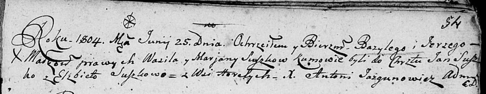

**Сушко Цимох Василев (Szuszko Cimoch)**

15 января 1811 г -- крещение (НИАБ 136-13-894, лист 80, №5/1810-р
(ориг)).

**НИАБ 136-13-894:** Лист 80. **Метрическая запись №5/1811-р (ориг).**

{width="6.496527777777778in"
height="0.7918667979002625in"}

Осовская Покровская церковь. 15 января 1811 года. Метрическая запись о
крещении.

Szuszko Cimoch -- сын родителей с деревни Горелое.

Szuszko Wasil -- отец.

Szuszkowa Maryna -- мать.

Szuszko Mikołay -- кум.

Szuszkowna Ewa -- кума.

Woyniewicz Tomasz -- ксёндз.
