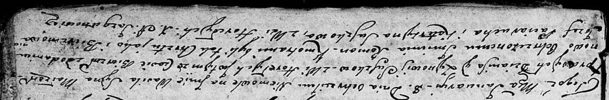

**Сушко Барбара Грыгорова (Suszkowna Barbara Magdalena)**

9 марта 1807 г -- крещение (НИАБ 136-13-894, лист 62, №14/1807-р
(ориг)).

**НИАБ 136-13-894:** Лист 53. **Метрическая запись №4/1804-р (ориг).**

Дедиловичская Покровская церковь. 14 февраля 1804 года. Метрическая
запись о крещении.

Suszko Leon -- сын родителей с деревни Горелое.

Suszko Hryhor -- отец.

Suszkowa Katerzyna -- мать.

Suszko Harasim -- кум.

Suszkowa Maryia -- кума.

Jazgunowicz Antoni -- ксёндз.

**НИАБ 136-13-894:** Лист 55об. **Метрическая запись №1/1805-р (ориг).**

Дедиловичская Покровская церковь. 8 января 1805 года. Метрическая запись
о крещении.

Suszko Wasil Roman -- дочь родителей с деревни Горелое.

Suszko Dzianis -- отец.

Suszkowa Zynowija -- мать.

Paciarucha Jozef -- кум, с деревни Горелое.

Suszkowa Katerzyna -- кума, с деревни Горелое.

Jazgunowicz Antoni -- ксёндз.

**НИАБ 136-13-894:** Лист 56. **Метрическая запись №6/1805-р (ориг).**

Дедиловичская Покровская церковь. 8 января 1805 года. Метрическая запись
о крещении.

Suszko Wasil Roman -- сын родителей с деревни Горелое.

Suszko Dzianis -- отец.

Suszkowa Zynowija -- мать.

Paciarucha Jozef -- кум.

Suszkowa Katerzyna -- кума, с деревни Горелое.

Jazgunowicz Antoni -- ксёндз.

**НИАБ 136-13-894:** Лист 62. **Метрическая запись №14/1807-р (ориг).**

Дедиловичская Покровская церковь. 9 марта 1807 года. Метрическая запись
о крещении.

Suszkowna Magdalena Barbara -- дочь родителей с деревни Горелое.

Suszko Hryszka -- отец.

Suszkowa Katerzyna -- мать.

Suszko Stefan -- кум, с деревни Разлитье.

Suszkowa Marya -- кума, с деревни Горелое.

Jazgunowicz Antoni -- ксёндз.
