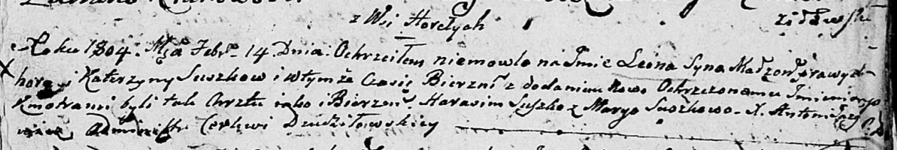
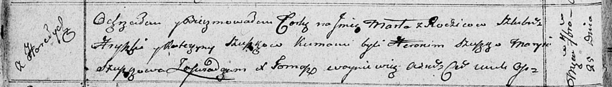

**Сушко, Шушко Грыгор, Грышка (Suszko, Szuszko Hryhor, Hryszka)**

14 февраля 1804 г -- крещение сына Леона (НИАБ 136-13-894, лист 53,
№4/1803-р (ориг)).

9 марта 1807 г -- крещение дочери Барбары Магдалены (НИАБ 136-13-894,
лист 62, №14/1807-р (ориг)).

25 сентября 1810 г -- крещение дочери Марты (НИАБ 136-13-894, лист 78об,
№43/1810-р (ориг)).

**НИАБ 136-13-894:** Лист 53. **Метрическая запись №4/1804-р (ориг).**

Дедиловичская Покровская церковь. 14 февраля 1804 года. Метрическая
запись о крещении.

Suszko Leon -- сын родителей с деревни Горелое.

Suszko Hryhor -- отец.

Suszkowa Katerzyna -- мать.

Suszko Harasim -- кум.

Suszkowa Maryia -- кума.

Jazgunowicz Antoni -- ксёндз.

**НИАБ 136-13-894:** Лист 62. **Метрическая запись №14/1807-р (ориг).**

Дедиловичская Покровская церковь. 9 марта 1807 года. Метрическая запись
о крещении.

Suszkowna Magdalena Barbara -- дочь родителей с деревни Горелое.

Suszko Hryszka -- отец.

Suszkowa Katerzyna -- мать.

Suszko Stefan -- кум, с деревни Разлитье.

Suszkowa Marya -- кума, с деревни Горелое.

Jazgunowicz Antoni -- ксёндз.

**НИАБ 136-13-894:** Лист 78об. **Метрическая запись №43/1810-р
(ориг).**

Осовская Покровская церковь. 25 сентября 1810 года. Метрическая запись о
крещении.

Szuszkowna Marta -- дочь родителей с деревни Горелое.

Szuszko Hryszka -- отец.

Szuszkowa Katerzyna -- мать.

Szuszko Heronim -- кум.

Szuszkowa Marya -- кума.

Woyniewicz Tomasz -- ксёндз.
