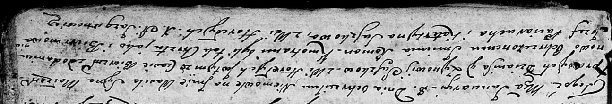

**Сушко, Шушко Катерына (Suszkowa, Szuszkowa Katerzyna)**

14 февраля 1804 г -- крещение сына Леона (НИАБ 136-13-894, лист 53,
№4/1803-р (ориг)).

8 января 1805 г -- крестная мать Василя Романа, сына Сушков Дениса и
Зыновии с деревни Горелое (НИАБ 136-13-894, лист 55об, №57/1805-р
(ориг), лист 56, №6/1805-р (об))

9 марта 1807 г -- крещение дочери Барбары Магдалены (НИАБ 136-13-894,
лист 62, №14/1807-р (ориг)).

11 августа 1807 г -- крестная мать Тадея Антона, сына Лапецов Степана и
Анны с деревни Разлитье (НИАБ 136-13-894, лист 63об, №37/1807-р (ориг)).

25 сентября 1810 г -- крещение дочери Марты (НИАБ 136-13-894, лист 78об,
№43/1810-р (ориг)).

**НИАБ 136-13-894:** Лист 53. **Метрическая запись №4/1804-р (ориг).**

{width="6.496527777777778in"
height="1.0976170166229222in"}

Дедиловичская Покровская церковь. 14 февраля 1804 года. Метрическая
запись о крещении.

Suszko Leon -- сын родителей с деревни Горелое.

Suszko Hryhor -- отец.

Suszkowa Katerzyna -- мать.

Suszko Harasim -- кум.

Suszkowa Maryia -- кума.

Jazgunowicz Antoni -- ксёндз.

**НИАБ 136-13-894:** Лист 55об. **Метрическая запись №1/1805-р (ориг).**

{width="6.496527777777778in"
height="1.0754910323709537in"}

Дедиловичская Покровская церковь. 8 января 1805 года. Метрическая запись
о крещении.

Suszko Wasil Roman -- дочь родителей с деревни Горелое.

Suszko Dzianis -- отец.

Suszkowa Zynowija -- мать.

Paciarucha Jozef -- кум, с деревни Горелое.

Suszkowa Katerzyna -- кума, с деревни Горелое.

Jazgunowicz Antoni -- ксёндз.

**НИАБ 136-13-894:** Лист 56. **Метрическая запись №6/1805-р (ориг).**

{width="6.496527777777778in"
height="1.108345363079615in"}

Дедиловичская Покровская церковь. 8 января 1805 года. Метрическая запись
о крещении.

Suszko Wasil Roman -- сын родителей с деревни Горелое.

Suszko Dzianis -- отец.

Suszkowa Zynowija -- мать.

Paciarucha Jozef -- кум.

Suszkowa Katerzyna -- кума, с деревни Горелое.

Jazgunowicz Antoni -- ксёндз.

**НИАБ 136-13-894:** Лист 62. **Метрическая запись №14/1807-р (ориг).**

{width="6.496527777777778in"
height="0.8803740157480315in"}

Дедиловичская Покровская церковь. 9 марта 1807 года. Метрическая запись
о крещении.

Suszkowna Magdalena Barbara -- дочь родителей с деревни Горелое.

Suszko Hryszka -- отец.

Suszkowa Katerzyna -- мать.

Suszko Stefan -- кум, с деревни Разлитье.

Suszkowa Marya -- кума, с деревни Горелое.

Jazgunowicz Antoni -- ксёндз.

**НИАБ 136-13-894:** Лист 63об. **Метрическая запись №37/1807-р
(ориг).**

{width="6.496527777777778in"
height="1.6192705599300088in"}

Дедиловичская Покровская церковь. 11 августа 1807 года. Метрическая
запись о крещении.

Łapać Thadeusz Antoni -- сын родителей с деревни Разлитье.

Łapać Stefan -- отец.

Łapciowa Anna -- мать.

Szyłak Bautruk -- кум, с деревни Горелое.

Suszkowa Katerzyna -- кума, с деревни Горелое.

Jazgunowicz Antoni -- ксёндз.

**НИАБ 136-13-894:** Лист 78об. **Метрическая запись №43/1810-р
(ориг).**

{width="6.496527777777778in"
height="0.9340146544181978in"}

Осовская Покровская церковь. 25 сентября 1810 года. Метрическая запись о
крещении.

Szuszkowna Marta -- дочь родителей с деревни Горелое.

Szuszko Hryszka -- отец.

Szuszkowa Katerzyna -- мать.

Szuszko Heronim -- кум.

Szuszkowa Marya -- кума.

Woyniewicz Tomasz -- ксёндз.
