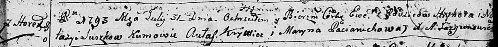

**Сушко Ева Грыгорова (Suszkowna Ewa)**

31 июля 1793 г -- крещение (НИАБ 136-13-894, лист 20, №58/1793-р
(ориг)).

**НИАБ 136-13-894:** Лист 20. **Метрическая запись №58/1793-р (ориг).**

{width="6.496527777777778in"
height="0.6182064741907262in"}

Дедиловичская Покровская церковь. 31 июля 1793 года. Метрическая запись
о крещении.

Suszkowna Ewa -- дочь родителей с деревни Горелое.

Suszko Hryhor -- отец.

Suszkowa Nastazyia -- мать.

Krywiec Aulas - кум.

Paciaruchowa Maryna - кума.

Jazgunowicz Antoni -- ксёндз.
