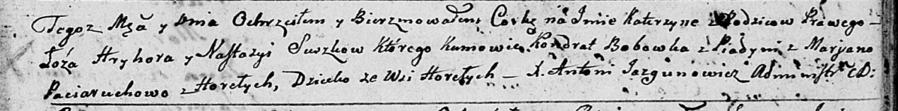
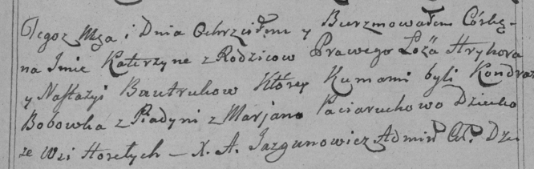
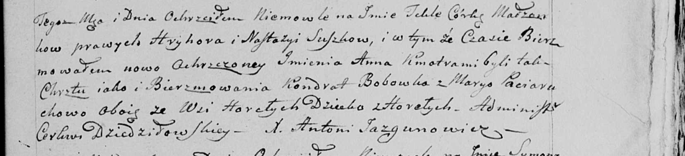

**Сушко Катерына Грыгорова (Suszkowna Katerzyna)**

9 ноября 1799 г -- крещение (НИАБ 136-13-894, лист 40, №47/1799-р
(ориг), РГИА 823-2-18, лист 273, №46/1799-р (коп), НИАБ 136-13-938, лист
245, №43/1799-р (коп)).

**НИАБ 136-13-894:** Лист 40. **Метрическая запись №47/1799-р (ориг).**

Дедиловичская Покровская церковь. 9 ноября 1799 года. Метрическая запись
о крещении.

Suszkowna Katerzyna -- дочь родителей с деревни Горелое.

Suszko Hryhor -- отец.

Suszkowa Nastazyja -- мать.

Bobowka Kondrat -- кум, с деревни Пядынь.

Paciaruchowa Marjana -- кума, с деревни Горелое.

Jazgunowicz Antoni -- ксёндз.

**РГИА 823-2-18:** Лист 273. **Метрическая запись №46/1799-р (коп).**

Дедиловичская Покровская церковь. \[6\] ноября 1799 года. Метрическая
запись о крещении.

\[Suszkowna\] Katerzyna -- дочь родителей с деревни Горелое.

\[Suszko\] Hryhor -- отец.

\[Suszkowa\] Nastazyja -- мать.

Bobowka Kondrat -- кум, с деревни Пядань.

Paciaruchowa Marjana -- кума.

Jazgunowicz Antoni -- ксёндз.

**НИАБ 136-13-938:** Лист 245. **Метрическая запись №43/1799-р (коп).**

(См. тж. НИАБ 136-13-894, лист 40, №47/1799-р (ориг); РГИА 823-2-18,
лист 273, №46/1799-р (коп))

Дедиловичская Покровская церковь. 6 ноября 1799 года. Метрическая запись
о крещении.

Suszkowna Tekla \[Katerzyna\] Anna -- дочь родителей с деревни Горелое.

Suszko Hryhor -- отец.

Suszkowa Nastazya -- мать.

Bobowka Kondrat -- кум, с деревни Горелое \[Пядань\].

Paciaruchowa Marya - кума,с деревни Горелое.

Jazgunowicz Antoni -- ксёндз.
