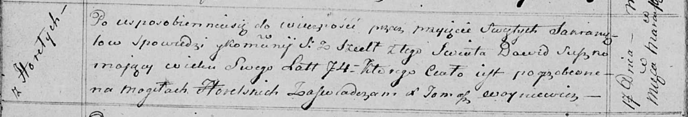

**Сушко Давид (Suszko Dawid)**

6 января 1796 г -- крещение сына Адама (НИАБ 136-13-894, лист 27,
№3/1796-р (об)), (РГИА 823-2-18, лист 254об, №3/1796-р (коп)).

19 сентября 1798 г -- крещение дочери Елисаветы (НИАБ 136-13-894, лист
37, №46/1798-р (об)), (РГИА 823-2-18, лист 266, №47/1798-р (коп)).

13 февраля 1808 г -- крещение сына Мартыана (НИАБ 136-13-894, лист 64об,
№10/1808-р (об)).

24 октября 1809 г -- крещение сына Якуба (НИАБ 136-13-894, лист 76,
№56/1809-р (об)).

17 марта 1815 г -- отпевание, умер в возрасте 74 лет (родился около 1741
г) (НИАБ 136-13-919, лист 28об, №6/1815-у (об)).

**НИАБ 136-13-894:** Лист 27. **Метрическая запись №3/1796-р (ориг).**

Дедиловичская Покровская церковь. 6 января 1796 года. Метрическая запись
о крещении.

Suszko Adam -- сын родителей с деревни Горелое.

Suszko Dawid -- отец.

Suszkowa Paraska -- мать.

Suszko Dzianis - кум.

Suszkowa Maryia - кума.

Jazgunowicz Antoni -- ксёндз.

**РГИА 823-2-18:** Лист 254об. **Метрическая запись №3/1796-р (коп).**

Дедиловичская Покровская церковь. 6 января 1796 года. Метрическая запись
о крещении.

Suszko Adam -- сын родителей с деревни Горелое.

Suszko Dawid -- отец.

Suszkowa Paraska -- мать.

Szuszko Dzianis -- кум.

Suszkowa Marya -- кума.

Jazgunowicz Antoni -- ксёндз.

**НИАБ 136-13-894:** Лист 37. **Метрическая запись №46/1798-р (ориг).**

Дедиловичская Покровская церковь. 19 сентября 1798 года. Метрическая
запись о крещении.

Suszkowa Elżbieta -- дочь родителей с деревни Горелое.

Suszko Dawid -- отец.

Suszkowa Parasia -- мать.

Suszko Dzianis - кум.

Suszkowa Marya - кума.

Jazgunowicz Antoni -- ксёндз.

**РГИА 823-2-18:** Лист 266. **Метрическая запись №47/1798-р (коп).**

Дедиловичская Покровская церковь. 19 сентября 1798 года. Метрическая
запись о крещении.

Suszkowna Elżbieta -- дочь родителей с деревни Горелое.

Suszko Dawyd -- отец.

Suszkowa Parasia -- мать.

Suszko Dzianis -- кум.

Szuszkowa Maria -- кума.

Jazgunowicz Antoni -- ксёндз.

**НИАБ 136-13-894:** Лист 64об. **Метрическая запись №10/1808-р
(ориг).**

Дедиловичская Покровская церковь. 13 февраля 1808 года. Метрическая
запись о крещении.

Suszko Martyan -- сын родителей с деревни Горелое.

Suszko Dawid -- отец.

Suszkowa Paraxieda -- мать.

Suszko Dzianis -- кум.

Suszkowa Marya -- кума.

Jazgunowicz Antoni -- ксёндз.

**НИАБ 136-13-894:** Лист 76. **Метрическая запись №56/1809-р (ориг).**

Дедиловичская Покровская церковь. 24 октября 1809 года. Метрическая
запись о крещении.

Suszko Jakub -- сын родителей из деревни Горелое.

Suszko Dawid -- отец.

Suszkowa Parasia -- мать.

Suszko Dzianis -- кум.

Suszkowa Maruta -- кума.

Jazgunowicz Antoni -- ксёндз.

**НИАБ 136-13-919:** Лист 28об. **Метрическая запись №6/1815-у (ориг).**

Осовская униатская церковь. 17 марта 1815 года. Метрическая запись об
отпевании.

Suszko Dawid -- умерший, 74 года, с деревни Горелое, похоронен на
кладбище деревни Горелое.

Woyniewicz Tomasz -- ксёндз.
