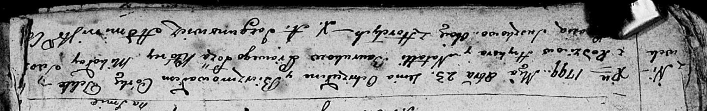

**Сушко Якуб Давидов (Suszko Jakub)**

24 октября 1809 г -- крещение (НИАБ 136-13-894, лист 76, №56/1809-р
(об)).

**НИАБ 136-13-894:** Лист 76. **Метрическая запись №56/1809-р (ориг).**

{width="6.496527777777778in"
height="0.9252974628171479in"}

Дедиловичская Покровская церковь. 24 октября 1809 года. Метрическая
запись о крещении.

Suszko Jakub -- сын родителей из деревни Горелое.

Suszko Dawid -- отец.

Suszkowa Parasia -- мать.

Suszko Dzianis -- кум.

Suszkowa Maruta -- кума.

Jazgunowicz Antoni -- ксёндз.
