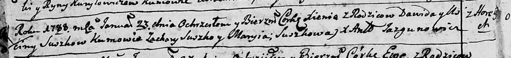
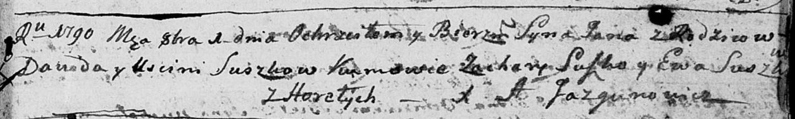
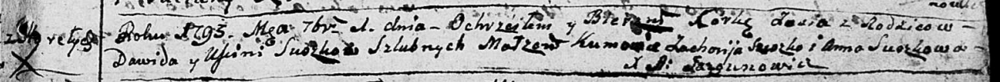
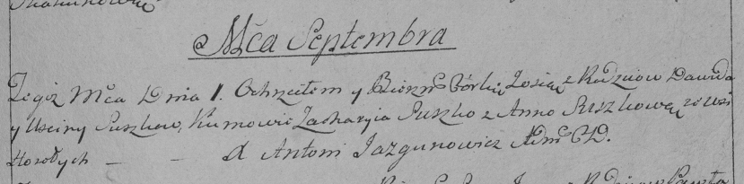

**Сушко Давид (Suszko Dawid)**

23 января 1788 г -- крещение дочери Ксени (НИАБ 136-13-894, лист 3об,
№10/1788-р (об)).

1 октября 1790 г -- крещение сына Яна (НИАБ 136-13-894, лист 11,
№69/1790-р (об)).

1 сентября 1793 г -- крещение дочери Зоси (НИАБ 136-13-894, лист 20,
№63/1793-р (об)), (РГИА 823-2-18, лист 248, №35/1793-р (коп)).

**НИАБ 136-13-894:** Лист 3об. **Метрическая запись №10/1788-р (ориг).**

Дедиловичская Покровская церковь. 23 января 1788 года. Метрическая
запись о крещении.

Suszkowna Xienia -- дочь родителей с деревни Горелое.

Suszko Dawid -- отец.

Suszkowa Uscina -- мать.

Suszko Zachary - кум.

Suszkowa Maryia - кума.

Jazgunowicz Antoniusz -- ксёндз.

**НИАБ 136-13-894:** Лист 11. **Метрическая запись №69/1790-р (ориг).**

Дедиловичская Покровская церковь. 1 октября 1790 года. Метрическая
запись о крещении.

Suszko Jan -- сын родителей с деревни Горелое.

Suszko Dawid -- отец.

Suszkowa Uscinia -- мать.

Suszko Zachary - кум.

Suszkowa Ewa - кума.

Jazgunowicz Antoni -- ксёндз.

Лист 20. **Метрическая запись №63/1793-р (ориг).**

Дедиловичская Покровская церковь. 1 сентября 1793 года. Метрическая
запись о крещении.

Suszkowna Zosia -- дочь родителей с деревни Горелое.

Suszko Dawid -- отец.

Suszkowa Uscinia -- мать.

Suszko Zacharija - кум.

Suszkowa Anna - кума.

Jazgunowicz Antoni -- ксёндз.

**РГИА 823-2-18:** Лист 248. **Метрическая запись №35/1793-р (коп).**

Дедиловичская Покровская церковь. 1 сентября 1793 года. Метрическая
запись о крещении.

Suszkowna Zosia -- дочь родителей с деревни Горелое.

Suszko Dawid -- отец.

Suszkowa Uscina -- мать.

Suszko Zachary -- кум.

Suszkowa Anna -- кума.

Jazgunowicz Antoni -- ксёндз.
