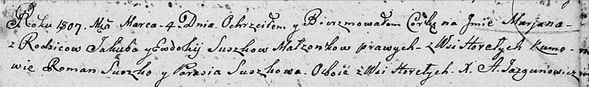

**Сушко Парася (Suszkowa Parasia)**

25 сентября 1804 г -- крещение дочери Агафии Елены (НИАБ 136-13-894,
лист 55, №40/1804-р (об)).

4 марта 1807 г - возможно, крестная мать Марьяны, дочери Сушков Якуба и
Евдокии с деревни Горелое (НИАБ 136-13-894, лист 62, №13/1807-р (ориг)).

**НИАБ 136-13-894:** Лист 55. **Метрическая запись №40/1804-р (ориг).**

{width="6.496527777777778in"
height="0.7516371391076115in"}

Дедиловичская Покровская церковь. 25 сентября 1804 года. Метрическая
запись о крещении.

Suszkowna Ahafija Elena -- дочь родителей с деревни Горелое.

Suszko Daniła -- отец.

Suszkowa Parasia -- мать.

Suszko Dzianis -- кум.

Kuryliczowa Maryia -- кума.

Jazgunowicz Antoni -- ксёндз.

**НИАБ 136-13-894:** Лист 62. **Метрическая запись №13/1807-р (ориг).**

{width="6.496527777777778in"
height="0.9735739282589676in"}

Дедиловичская Покровская церковь. 4 марта 1807 года. Метрическая запись
о крещении.

Suszkowna Marjana -- дочь родителей с деревни Горелое.

Suszko Jakub -- отец.

Suszkowa Ewdokija -- мать.

Suszko Roman -- кум, с деревни Горелое.

Suszkowa Parasia -- кума, с деревни Горелое.

Jazgunowicz Antoni -- ксёндз.
