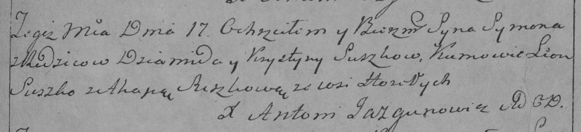

**Сушко Демид (Suszko Dziamid)**

12 мая 1791 г -- венчание с вдовой Крыстыной Курнеш (НИАБ 136-13-894,
лист 69об, №12/1791-б (об)).

17 апреля 1793 г -- крещение сына Сымона (НИАБ 136-13-894, лист 19об,
№36/1793-р (об)), (РГИА 823-2-18, лист 247, №16/1793-р (коп)).

Лист 69об. **Метрическая запись №12/1791-б (ориг).**

{width="6.496527777777778in"
height="1.4107436570428697in"}

Дедиловичская Покровская церковь. 12 мая 1791 года. Метрическая запись о
венчании.

Suszko Dziamid -- жених, вдовец, с деревни \[Горелое\].

Kurneszowa Krystyna -- невеста, вдова.

Suszkowicz Zacharyia -- свидетель.

Kierko Mikołay -- свидетель.

Jazgunowicz Antoni -- ксёндз.

**НИАБ 136-13-894:** Лист 19-об. **Метрическая запись №36/1793-р
(ориг).**

{width="6.496527777777778in"
height="0.8106408573928259in"}

Дедиловичская Покровская церковь. 17 апреля 1793 года. Метрическая
запись о крещении.

Suszko Symon -- сын родителей с деревни Горелое.

Suszko Dziamid -- отец.

Suszkowa Krystyna -- мать.

Suszko Leon - кум.

Suszkowa Ahapa - кума.

Jazgunowicz Antoni -- ксёндз.

**РГИА 823-2-18:** Лист 247. **Метрическая запись №16/1793-р (коп).**

{width="6.496527777777778in"
height="1.4847222222222223in"}

Дедиловичская Покровская церковь. 17 апреля 1793 года. Метрическая
запись о крещении.

Suszkowna Symon -- сын родителей с деревни Горелое.

Suszko Dziamid -- отец.

Suszkowa Krystyna -- мать.

Suszko Leon -- кум.

Suszkowa Ahapa -- кума.

Jazgunowicz Antoni -- ксёндз.
