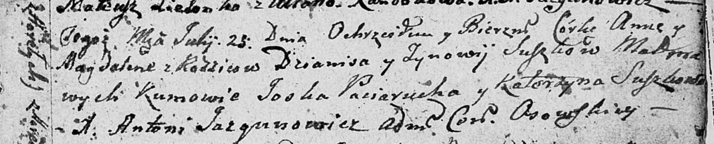

**Сушко Анна Денисова (Suszkowna Anna Magdalena)**

23 июля 1807 г -- крещение (НИАБ 136-13-894, лист 63, №35/1807-р (об)).

**НИАБ 136-13-894:** Лист 63. **Метрическая запись №35/1807-р (ориг).**

Осовская Покровская церковь. 23 июля 1807 года. Метрическая запись о
крещении.

Suszkowna Anna Magdalena -- дочь родителей с деревни Горелое.

Suszko Dzianis -- отец.

Suszkowa Zynowija -- мать.

Paciarucha Jośka -- кум.

Suszkowa Katerzyna -- кума.

Jazgunowicz Antoni -- ксёндз.
