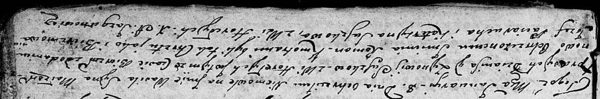

**Сушко Василь Денисов (Suszko Wasil Roman)**

8 января 1805 г -- крещение сына Василя Романа (НИАБ 136-13-894, лист
55об, №1/1805-р (об), лист 56, №6/1805-р (об)).

**НИАБ 136-13-894:** Лист 55об. **Метрическая запись №1/1805-р (ориг).**

Дедиловичская Покровская церковь. 8 января 1805 года. Метрическая запись
о крещении.

Suszko Wasil Roman -- дочь родителей с деревни Горелое.

Suszko Dzianis -- отец.

Suszkowa Zynowija -- мать.

Paciarucha Jozef -- кум, с деревни Горелое.

Suszkowa Katerzyna -- кума, с деревни Горелое.

Jazgunowicz Antoni -- ксёндз.

**НИАБ 136-13-894:** Лист 56. **Метрическая запись №6/1805-р (ориг).**

Дедиловичская Покровская церковь. 8 января 1805 года. Метрическая запись
о крещении.

Suszko Wasil Roman -- сын родителей с деревни Горелое.

Suszko Dzianis -- отец.

Suszkowa Zynowija -- мать.

Paciarucha Jozef -- кум.

Suszkowa Katerzyna -- кума, с деревни Горелое.

Jazgunowicz Antoni -- ксёндз.
