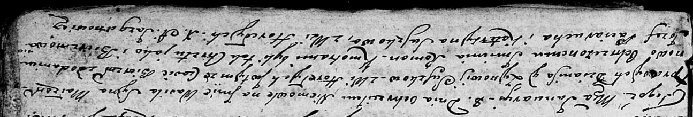

**Сушко Зыновия (Suszkowa Zynowija)**

22 января 1802 г -- крещение дочери Настасьи Елисаветы (НИАБ 136-13-894,
лист 46, №6/1802-р (об)).

8 января 1805 г -- крещение сына Василя Романа (НИАБ 136-13-894, лист
55об, №1/1805-р (об)), лист 56, №6/1805-р (об))

23 июля 1807 г -- крещение дочери Анны Магдалены (НИАБ 136-13-894, лист
63, №35/1807-р (об)).

30 апреля 1816 г -- крещение дочери Магдалены (НИАБ 136-13-894, лист
93об, №8/1816-р (об)).

**НИАБ 136-13-894:** Лист 46. **Метрическая запись №6/1802-р (ориг).**

{width="6.496527777777778in"
height="1.326259842519685in"}

Дедиловичская Покровская церковь. 22 февраля 1802 года. Метрическая
запись о крещении.

Suszkowna Nastazyja Elżbieta -- дочь родителей с деревни Горелое.

Suszko Dzianis -- отец.

Suszkowa Zynowija -- мать.

Paciarucha Cimoch -- кум.

Suszkowa Ewdokija -- кума.

Jazgunowicz Antoni -- ксёндз.

**НИАБ 136-13-894:** Лист 55об. **Метрическая запись №1/1805-р (ориг).**

{width="6.496527777777778in"
height="1.0754910323709537in"}

Дедиловичская Покровская церковь. 8 января 1805 года. Метрическая запись
о крещении.

Suszko Wasil Roman -- дочь родителей с деревни Горелое.

Suszko Dzianis -- отец.

Suszkowa Zynowija -- мать.

Paciarucha Jozef -- кум, с деревни Горелое.

Suszkowa Katerzyna -- кума, с деревни Горелое.

Jazgunowicz Antoni -- ксёндз.

**НИАБ 136-13-894:** Лист 56. **Метрическая запись №6/1805-р (ориг).**

{width="6.496527777777778in"
height="1.108345363079615in"}

Дедиловичская Покровская церковь. 8 января 1805 года. Метрическая запись
о крещении.

Suszko Wasil Roman -- сын родителей с деревни Горелое.

Suszko Dzianis -- отец.

Suszkowa Zynowija -- мать.

Paciarucha Jozef -- кум.

Suszkowa Katerzyna -- кума, с деревни Горелое.

Jazgunowicz Antoni -- ксёндз.

**НИАБ 136-13-894:** Лист 63. **Метрическая запись №35/1807-р (ориг).**

{width="6.496527777777778in"
height="1.312179571303587in"}

Осовская Покровская церковь. 23 июля 1807 года. Метрическая запись о
крещении.

Suszkowna Anna Magdalena -- дочь родителей с деревни Горелое.

Suszko Dzianis -- отец.

Suszkowa Zynowija -- мать.

Paciarucha Jośka -- кум.

Suszkowa Katerzyna -- кума.

Jazgunowicz Antoni -- ксёндз.

**НИАБ 136-13-894:** Лист 93об. **Метрическая запись №8/1816-р (ориг).**

{width="6.496527777777778in"
height="0.8951246719160105in"}

Осовская Покровская церковь. 30 апреля 1816 года. Метрическая запись о
крещении.

Suszkowna Magdalena -- дочь родителей с деревни Горелое.

Suszko Dzianis -- отец.

Suszkowa Zienowija -- мать.

Paciarucha Jozef -- кум.

Suszkowa Katerzyna -- кума.

Woyniewicz Tomasz -- ксёндз.
