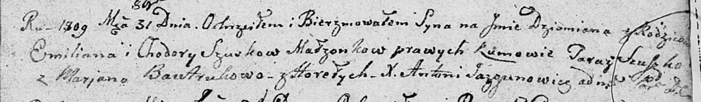

**Сушко Демьян Емельянов (Suszko Dziamian)**

31 октября 1809 г -- крещение (НИАБ 136-13-894, лист 76, №59/1809-р
(об)).

**НИАБ 136-13-894:** Лист 76. **Метрическая запись №59/1809-р (ориг).**

{width="6.496527777777778in"
height="0.9494356955380577in"}

Дедиловичская Покровская церковь. 31 октября 1809 года. Метрическая
запись о крещении.

Szuszko Dziamian -- сын родителей из деревни Горелое.

Szuszko Emilian -- отец.

Szuszkowa Chodora -- мать.

Szuszko Taraz -- кум.

Bautrukowa Marjana -- кума.

Jazgunowicz Antoni -- ксёндз.
