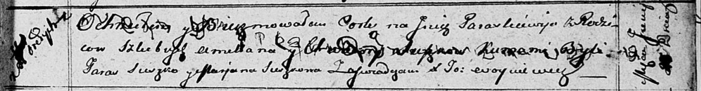

**Сушко Параскевия Емельянова (Suszkowna Paraskiewija)**

2\_ июля 1812 г -- крещение (НИАБ 136-13-894, лист 85, №38/1812-р (об)).

**НИАБ 136-13-894:** Лист 85. **Метрическая запись №38/1812-р (ориг).**

{width="6.496527777777778in"
height="0.8535531496062992in"}

Осовская Покровская церковь. 2\[\] июля 1812 года. Метрическая запись о
крещении.

Suszkowna Paraskiewija -- дочь родителей с деревни Горелое.

Suszko Amillan -- отец.

Suszkowa Chwiedora -- мать.

Suszko Taras -- кум.

Suszkowa Marjana -- кума.

Woyniewicz Tomasz -- ксёндз.
