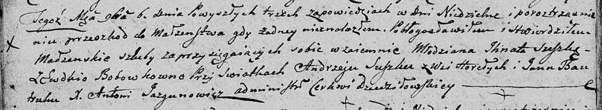
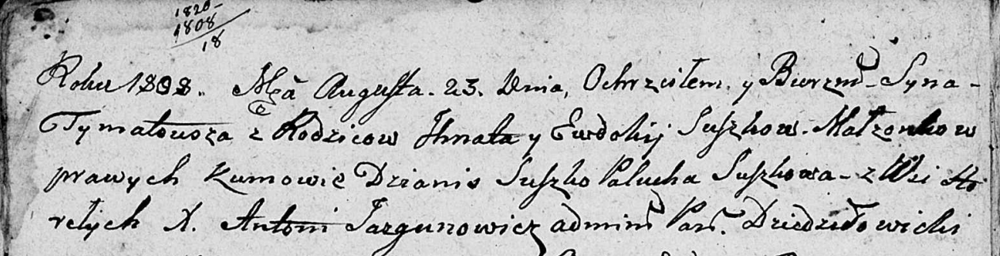
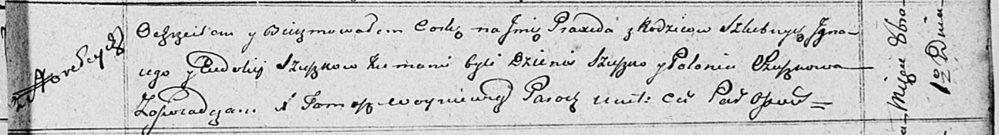
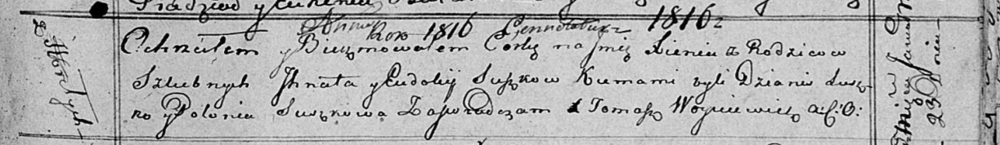
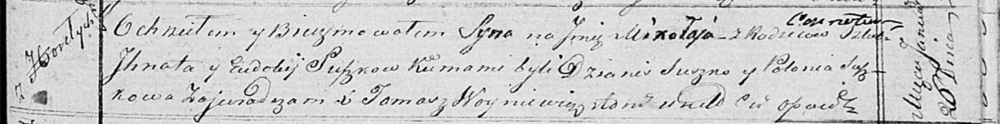
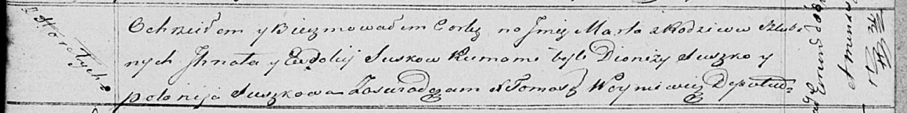

**Сушко Игнат (Suszko, Szuszko Jhnat, Jhnacy)**

6 ноября 1804 г -- венчание с Евдокией Бобовко (НИАБ 136-13-920, лист
10об, №8/1804-б (ориг)).

27 ноября 1804 г -- крестный отец Настасьи Текли, дочери Сушков Самуэля
и Марыи с деревни Горелое (НИАБ 136-13-894, лист 55об, №56/1804-р
(ориг)).

23 августа 1808 г -- крещение сына Тымата (НИАБ 136-13-894, лист 72об,
№34/1808-р (об)).

1 октября 1811 г -- крещение дочери Пракседы (НИАБ 136-13-894, лист 82,
№49/1811-р (об)).

23 января 1816 г -- крещение дочери Ксени (НИАБ 136-13-894, лист 93,
№1/1816-р (об)).

26 января 1819 г -- крещение сына Миколая (НИАБ 136-13-894, лист 100,
№7/1819-р (об)).

1 марта 1821 г -- крещение дочери Марты (НИАБ 136-13-894, лист 106,
№14/1821-р (об)).

**НИАБ 136-13-920:** Лист 10об. **Метрическая запись №8/1804-б (ориг).**

Дедиловичская Покровская церковь. 6 ноября 1804 года. Метрическая запись
о венчании.

Suszko Jhnat -- жених, молодой, с деревни \[Горелое\].

Bobowkowna Ewdokia -- невеста.

Suszko Andrzey -- свидетель, с деревни Горелое.

Bautruk Jan -- свидетель.

Jazgunowicz Antoni -- ксёндз.

**НИАБ 136-13-894:** Лист 55об. **Метрическая запись №56/1804-р
(ориг).**

Дедиловичская Покровская церковь. 27 ноября 1804 года. Метрическая
запись о крещении.

Suszkowna Nastazya Tekla -- дочь родителей с деревни Горелое.

Suszko Samuel -- отец.

Suszkowa Maryia -- мать.

Suszko Jhnat -- кум, с деревни Горелое.

Suszkowa Parasia -- кума, с деревни Горелое.

Jazgunowicz Antoni -- ксёндз.

**НИАБ 136-13-894:** Лист 72об. **Метрическая запись №34/1808-р
(ориг).**

Дедиловичская Покровская церковь. 23 августа 1808 года. Метрическая
запись о крещении.

Suszko Tymatousz -- дочь родителей с деревни Горелое.

Suszko Jhnat -- отец.

Suszkowa Ewdokija -- мать.

Suszko Dzianis -- кум.

Suszkowa Palucha -- кума.

Jazgunowicz Antoni -- ксёндз.

**НИАБ 136-13-894:** Лист 82. **Метрическая запись №49/1811-р (ориг).**

Осовская Покровская церковь. 1 октября 1811 года. Метрическая запись о
крещении.

Szuszkowna Praxeda -- дочь родителей с деревни Горелое.

Szuszko Jhnacy -- отец.

Szuszkowna Eudokija -- мать.

Szuszko Dzienis -- кум.

Szuszkowa Połonia -- кума.

Woyniewicz Tomasz -- ксёндз.

**НИАБ 136-13-894:** Лист 93. **Метрическая запись №1/1816-р (ориг).**

Осовская Покровская церковь. 23 января 1816 года. Метрическая запись о
крещении.

Suszkowna Xienia -- дочь родителей с деревни Горелое.

Suszko Jhnat -- отец.

Suszkowa Eudokija -- мать.

Suszko Dzianis -- кум.

Suszkowa Połonia -- кума.

Woyniewicz Tomasz -- ксёндз.

**НИАБ 136-13-894:** Лист 100. **Метрическая запись №7/1819-р (ориг).**

Осовская Покровская церковь. 26 января 1819 года. Метрическая запись о
крещении.

Suszko Mikołay -- сын родителей с деревни Горелое.

Suszko Jhnat -- отец.

Suszkowa Eudokia -- мать.

Suszko Dzianis -- кум.

Suszkowa Polonia -- кума.

Woyniewicz Tomasz -- ксёндз.

**НИАБ 136-13-894:** Лист 106. **Метрическая запись №14/1821-р (ориг).**

Осовская Покровская церковь. 1 марта 1821 года. Метрическая запись о
крещении.

Suszkowna Marta -- дочь родителей с деревни Горелое.

Suszko Jhnat -- отец.

Suszkowa Eudokija -- мать.

Suszko Dionizy -- кум.

Suszkowa Połonija -- кума.

Woyniewicz Tomasz -- ксёндз.
