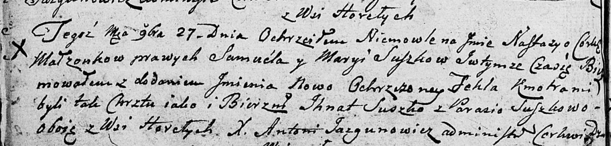

**Сушко Ксеня Игнатова (Suszkowna Xienia)**

23 января 1816 г -- крещение (НИАБ 136-13-894, лист 93, №1/1816-р (об)).

**НИАБ 136-13-894:** Лист 93. **Метрическая запись №1/1816-р (ориг).**

{width="6.496527777777778in"
height="0.9454122922134733in"}

Осовская Покровская церковь. 23 января 1816 года. Метрическая запись о
крещении.

Suszkowna Xienia -- дочь родителей с деревни Горелое.

Suszko Jhnat -- отец.

Suszkowa Eudokija -- мать.

Suszko Dzianis -- кум.

Suszkowa Połonia -- кума.

Woyniewicz Tomasz -- ксёндз.
