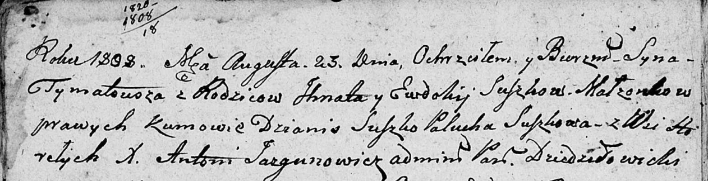

**Сушко Тымат Игнатов (Suszko Tymatousz)**

23 августа 1808 г -- крещение (НИАБ 136-13-894, лист 72об, №34/1808-р
(об)).

**НИАБ 136-13-894:** Лист 72об. **Метрическая запись №34/1808-р
(ориг).**

Дедиловичская Покровская церковь. 23 августа 1808 года. Метрическая
запись о крещении.

Suszko Tymatousz -- дочь родителей с деревни Горелое.

Suszko Jhnat -- отец.

Suszkowa Ewdokija -- мать.

Suszko Dzianis -- кум.

Suszkowa Palucha -- кума.

Jazgunowicz Antoni -- ксёндз.
