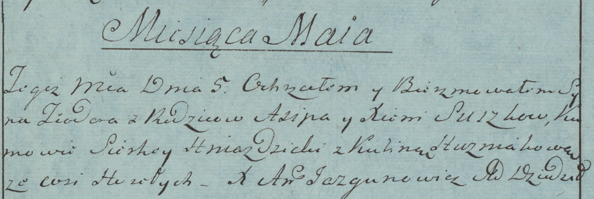

**Сушко Ксеня (Suszko Xienia)**

5 мая 1784 г -- крещение сына Тодора (РГИА 823-2-18, лист 226об,
№11/1784-р (коп)).

**РГИА 823-2-18:** Лист 226об. **Метрическая запись №11/1784-р (коп).**

Дедиловичская Покровская церковь. 5 мая 1784 года. Метрическая запись о
крещении.

Suszko Teodor -- сын родителей с деревни Горелое.

Suszko Asip -- отец.

Suszkowa Xienia -- мать.

Hniazdzicki Siarhey -- кум.

Huzniakowa Kulina - кума.

Jazgunowicz Antoni -- ксёндз.
