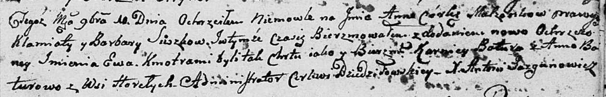

**Сушко Клямята (Suszko Klamiata)**

10 ноября 1801 г -- крещение дочери Анны Евы (НИАБ 136-13-894, лист 45,
№31/1801-р (об)).

**НИАБ 136-13-894:** Лист 45. **Метрическая запись №31/1801-р (ориг).**

Дедиловичская Покровская церковь. 10 ноября 1801 года. Метрическая
запись о крещении.

Suszkowna Anna Ewa -- дочь родителей с деревни Горелое.

Suszko Klamiata -- отец.

Suszkowa Barbara -- мать.

Botura Karniey -- кум.

Boturowa Anna -- кума.

Jazgunowicz Antoni -- ксёндз.
