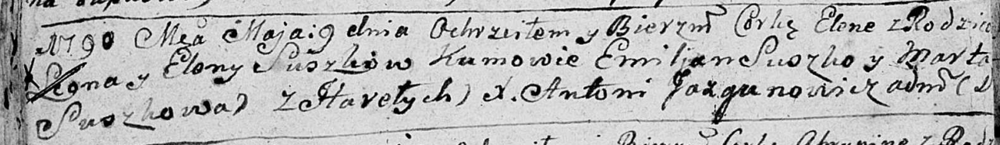

**Сушко Леон (Suszko Leon)**

9 мая 1790 г -- крещение дочери Елены (НИАБ 136-13-894, лист 9об,
№30/1790-р (об)).

**НИАБ 136-13-894:** Лист 9об. **Метрическая запись №30/1790-р (ориг).**

Дедиловичская Покровская церковь. 9 мая 1790 года. Метрическая запись о
крещении.

Suszkowna Elena -- дочь родителей с деревни Горелое.

Suszko Leon -- отец.

Suszkowa Elena -- мать.

Suszko Emiljan - кум.

Suszkowa Marta - кума.

Jazgunowicz Antoni -- ксёндз.
