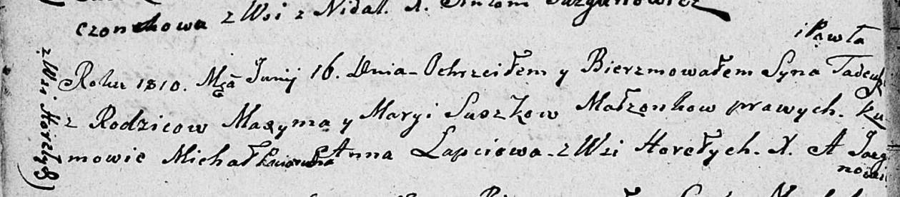

**Сушко Тадей Максымов (Suszko Tadeusz Paweł)**

16 июня 1810 г -- крещение (НИАБ 136-13-894, лист 77об, №21/1810-р
(ориг)).

**НИАБ 136-13-894:** Лист 77об. **Метрическая запись №21/1810-р
(ориг).**

Дедиловичская Покровская церковь. 16 июня 1810 года. Метрическая запись
о крещении.

Suszko Tadeusz Pawel -- сын родителей из деревни Горелое.

Suszko Maxym -- отец.

Suszko Marya -- мать.

Paciarucha Michał -- кум, с деревни Горелое.

Łapciowa Anna -- кума, с деревни Горелое.

Jazgunowicz Antoni -- ксёндз.
