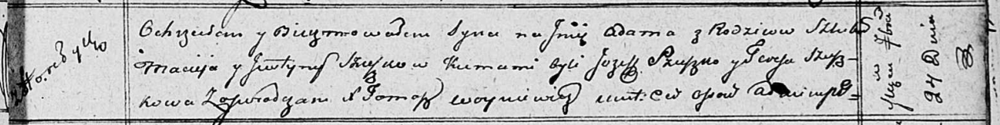

**Сушко Адам Мацеев (Szuszko Adam)**

24 сентября 1811 г -- крещение (НИАБ 136-13-894, лист 82, №47/1811-р
(ориг)).

**НИАБ 136-13-894:** Лист 82. **Метрическая запись №47/1811-р (ориг).**

Осовская Покровская церковь. 24 сентября 1811 года. Метрическая запись о
крещении.

Szuszko Adam -- сын родителей с деревни Горелое.

Szuszko Maciey -- отец.

Szuszkowa Justyna -- мать.

Szuszko Jozef -- кум.

Szuszkowa Teresa -- кума.

Woyniewicz Tomasz -- ксёндз.
