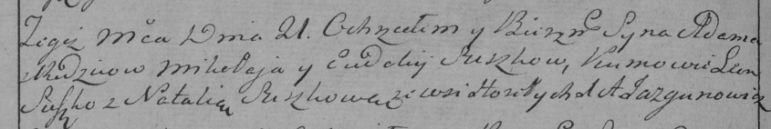

**Сушко Адам Миколаев (Suszko Adam)**

21 декабря 1791 г -- крещение (НИАБ 136-13-894, лист 14об, №66/1791-р
(ориг)), (РГИА 823-2-18, лист 243об, №34/1791-р (коп)).

**НИАБ 136-13-894:** Лист 14-об. **Метрическая запись №66/1791-р
(ориг).**

Дедиловичская Покровская церковь. 21 декабря 1791 года. Метрическая
запись о крещении.

Suszko Adam -- сын родителей с деревни Горелое.

Suszko Mikołay -- отец.

Suszkowa Ewdokija -- мать.

Suszko Leon - кум.

Suszkowa Natalla - кума.

Jazgunowicz Antoni -- ксёндз.

**РГИА 823-2-18:** Лист 243об. **Метрическая запись №34/1791-р (коп).**

Дедиловичская Покровская церковь. 21 декабря 1791 года. Метрическая
запись о крещении.

Suszko Adam -- сын родителей с деревни Горелое.

Suszko Mikołay -- отец.

Suszkowa Eudokija-- мать.

Suszko Leon -- кум.

Suszkowa Natalia - кума.

Jazgunowicz Antoni -- ксёндз.
