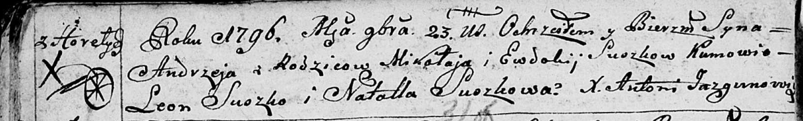
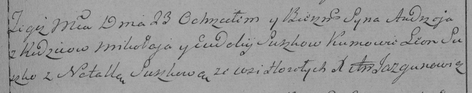

**Сушко Андрей Миколаев (Suszko Andrzey)**

23 ноября 1796 г -- крещение (НИАБ 136-13-894, лист 31об, №96/1796-р
(ориг)), (РГИА 823-2-18, лист 258, №59/1796-р (коп)).

**НИАБ 136-13-894:** Лист 31-об. **Метрическая запись №96/1796-р
(ориг).**

Дедиловичская Покровская церковь. 23 ноября 1796 года. Метрическая
запись о крещении.

Suszko Andrzey -- сын родителей с деревни Горелое.

Suszko Mikołay -- отец.

Suszki Ewdokija -- мать.

Suszko Leon - кум.

Suszkowa Natalla - кума.

Jazgunowicz Antoni -- ксёндз.

**РГИА 823-2-18:** Лист 258. **Метрическая запись №59/1796-р (коп).**

Дедиловичская Покровская церковь. 23 ноября 1796 года. Метрическая
запись о крещении.

Suszko Andrzey -- сын родителей с деревни Горелое.

Suszko Mikołay -- отец.

Suszkowa Eudokija -- мать.

Suszko Leon -- кум.

Suszkowa Natalla -- кума.

Jazgunowicz Antoni -- ксёндз.
