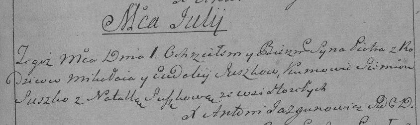

**Сушко Евдокия (Suszkowa Ewdokija)**

2 ноября 1784 г -- крещение дочери Кацерыны (РГИА 823-12-18, лист 227об,
№24/1784-р (коп)).

1 июля 1789 г -- крещение сына Петра (НИАБ 136-13-894, лист 7,
№33/1789-р (ориг)), (РГИА 823-2-18, лист 238, №14/1789-р (коп)).

21 декабря 1791 г -- крещение сына Адама (НИАБ 136-13-894, лист 14об,
№66/1791-р (ориг)), (РГИА 823-2-18, лист 243об, №34/1791-р (коп)).

23 ноября 1796 г -- крещение сына Андрея (НИАБ 136-13-894, лист 31об,
№96/1796-р (ориг)), (РГИА 823-2-18, лист 258, №59/1796-р (коп)).

10 июля 1800 г -- крещение сына Самуэля Павла (НИАБ 136-13-894, лист
41об, №16/1800-р (ориг), РГИА 823-2-18, лист 276, №15/1800-р (коп), НИАБ
136-13-949, лист 102об, №17/1800-р (коп)).

23 января 1805 г -- возможно, крестная мать у Марьяны Агафии, дочери
Курнешов Ермака и Юстыны с деревни Домашковичи (НИАБ 136-13-894, лист
56об, №8/1805-р (ориг)).

10 апреля 1805 г -- возможно, крестная мать Елены Марты, дочери Кривцов
Кондрата и Евдокии с деревни Горелое (НИАБ 136-13-894, лист 57,
№21/1805-р (ориг)).

27 августа 1805 г -- крещение дочери Зоси Магдалены (НИАБ 136-13-894,
лист 58, №38/1805-р (ориг)).

**РГИА 823-2-18:** Лист 227об. **Метрическая запись №24/1784-р (коп).**

{width="6.496527777777778in"
height="1.8506944444444444in"}

Дедиловичская Покровская церковь. 2 ноября 1784 года. Метрическая запись
о крещении.

Suszkowna Katarzyna -- дочь родителей с деревни Горелое.

Suszko Mikołay -- отец.

Suszkowa Eudokija -- мать.

Suszko Leon -- кум.

Suszkowa Natalla - кума.

Jazgunowicz Antoni -- ксёндз.

**НИАБ 136-13-894:** Лист 7. **Метрическая запись №33/1789-р (ориг).**

{width="6.496527777777778in"
height="0.9279800962379703in"}

Дедиловичская Покровская церковь. 1 июля 1789 года. Метрическая запись о
крещении.

Suszko Piotr -- сын родителей с деревни Горелое.

Suszko Mikołaj -- отец.

Suszkowa Ewdokija -- мать.

Suszko Siemion - кум.

Suszkowa Natalla - кума.

Jazgunowicz Antoni -- ксёндз.

**РГИА 823-2-18:** Лист 238. **Метрическая запись №14/1789-р (коп).**

{width="6.496527777777778in"
height="1.9472222222222222in"}

Дедиловичская Покровская церковь. 1 июля 1789 года. Метрическая запись о
крещении.

Suszko Piotr -- сын родителей с деревни Горелое.

Suszko Mikołay -- отец.

Suszko Eudokija -- мать.

Suszko Siemion -- кум.

Suszkowa Natalla - кума.

Jazgunowicz Antoni -- ксёндз.

**НИАБ 136-13-894:** Лист 14-об. **Метрическая запись №66/1791-р
(ориг).**

{width="6.496527777777778in"
height="0.8367913385826772in"}

Дедиловичская Покровская церковь. 21 декабря 1791 года. Метрическая
запись о крещении.

Suszko Adam -- сын родителей с деревни Горелое.

Suszko Mikołay -- отец.

Suszkowa Ewdokija -- мать.

Suszko Leon - кум.

Suszkowa Natalla - кума.

Jazgunowicz Antoni -- ксёндз.

**РГИА 823-2-18:** Лист 243об. **Метрическая запись №34/1791-р (коп).**

{width="6.496527777777778in"
height="1.0916666666666666in"}

Дедиловичская Покровская церковь. 21 декабря 1791 года. Метрическая
запись о крещении.

Suszko Adam -- сын родителей с деревни Горелое.

Suszko Mikołay -- отец.

Suszkowa Eudokija-- мать.

Suszko Leon -- кум.

Suszkowa Natalia - кума.

Jazgunowicz Antoni -- ксёндз.

**НИАБ 136-13-894:** Лист 31-об. **Метрическая запись №96/1796-р
(ориг).**

{width="6.496527777777778in"
height="0.9869838145231846in"}

Дедиловичская Покровская церковь. 23 ноября 1796 года. Метрическая
запись о крещении.

Suszko Andrzey -- сын родителей с деревни Горелое.

Suszko Mikołay -- отец.

Suszki Ewdokija -- мать.

Suszko Leon - кум.

Suszkowa Natalla - кума.

Jazgunowicz Antoni -- ксёндз.

**РГИА 823-2-18:** Лист 258. **Метрическая запись №59/1796-р (коп).**

{width="6.496527777777778in"
height="1.2784722222222222in"}

Дедиловичская Покровская церковь. 23 ноября 1796 года. Метрическая
запись о крещении.

Suszko Andrzey -- сын родителей с деревни Горелое.

Suszko Mikołay -- отец.

Suszkowa Eudokija -- мать.

Suszko Leon -- кум.

Suszkowa Natalla -- кума.

Jazgunowicz Antoni -- ксёндз.

**НИАБ 136-13-894:** Лист 41об. **Метрическая запись №16/1800-р
(ориг).**

{width="6.496527777777778in"
height="1.3658202099737533in"}

Дедиловичская Покровская церковь. 10 июля 1800 года. Метрическая запись
о крещении.

Suszko Samuel Paweł -- сын родителей с деревни Горелое.

Suszko Mikołay -- отец.

Suszkowa Ewdokija -- мать.

Suszko Mikołay -- кум.

Suszkowa Natalla -- кума.

Jazgunowicz Antoni -- ксёндз.

**НИАБ 136-13-949:** Лист 102об. **Метрическая запись №17/1800-р
(коп).**

(См. тж.: РГИА 823-2-18, лист 276, №15/1800-р (коп), НИАБ 136-13-894,
лист 41об, №16/1800-р (ориг))

{width="6.496527777777778in"
height="2.984027777777778in"}

Дедиловичская Покровская церковь. 10 июля 1800 года. Метрическая запись
о крещении.

Suszko Samuel Paweł -- сын родителей с деревни Горелое.

Suszko Mikołay -- отец.

Suszkowa Ewdokia -- мать.

Suszko Mikołay -- кум, с деревни Горелое.

Suszkowa Natalla - кума, с деревни Горелое.

Jazgunowicz Antoni -- ксёндз.

**РГИА 823-2-18:** Лист 276. **Метрическая запись №15/1800-р (коп).**

{width="6.496527777777778in"
height="2.0729166666666665in"}

Дедиловичская Покровская церковь. 10 июля 1800 года. Метрическая запись
о крещении.

Suszko Samuel Paweł -- сын родителей с деревни \[Горелое\].

Suszko Mikołay -- отец.

Suszkowa Ewdokija -- мать.

Suszko Mikołay -- кум, с деревни Горелое.

Suszkowa Natalla -- кума, с деревни Горелое.

Jazgunowicz Antoni -- ксёндз.

**НИАБ 136-13-894:** Лист 56об. **Метрическая запись №8/1805-р (ориг).**

{width="6.496527777777778in"
height="1.2612204724409448in"}

Дедиловичская Покровская церковь. 23 января 1805 года. Метрическая
запись о крещении.

Kurneszowna Marjana Ahafia -- дочь родителей с деревни Домашковичи.

Kurnesz Jermak -- отец.

Kurneszowa Justyna -- мать.

Suszko Symon -- кум.

Suszkowa Ewdokija -- кума, с деревни Горелое.

Jazgunowicz Antoni -- ксёндз.

Лист 57. **Метрическая запись №21/1805-р (ориг).**

{width="6.496527777777778in"
height="0.9098764216972879in"}

Дедиловичская Покровская церковь. 10 апреля 1805 года. Метрическая
запись о крещении.

Krywcowna Elena Marta -- дочь родителей с деревни Горелое.

Kryweć Kondrat -- отец.

Krywcowa Ewdokija -- мать.

Suszko Pilip -- кум, с деревни Горелое.

Suszkowa Ewdokija -- кума, с деревни Горелое.

Jazgunowicz Antoni -- ксёндз.

**НИАБ 136-13-894:** Лист 58. **Метрическая запись №38/1805-р (ориг).**

{width="6.496527777777778in"
height="0.8656222659667542in"}

Дедиловичская Покровская церковь. 27 августа 1805 года. Метрическая
запись о крещении.

Suszkowna Zosia Magdalena -- дочь родителей с деревни Горелое.

Suszko Mikołay -- отец.

Suszkowa Ewdokija -- мать.

Suszko Wasil -- кум.

Suszkowa Natalla -- кума.

Jazgunowicz Antoni -- ксёндз.
