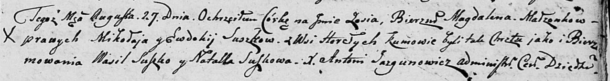

**Сушко Зося Миколаева (Suszkowna Zosia Mgdalena)**

27 августа 1805 г -- крещение (НИАБ 136-13-894, лист 58, №38/1805-р
(ориг)).

**НИАБ 136-13-894:** Лист 58. **Метрическая запись №38/1805-р (ориг).**

Дедиловичская Покровская церковь. 27 августа 1805 года. Метрическая
запись о крещении.

Suszkowna Zosia Magdalena -- дочь родителей с деревни Горелое.

Suszko Mikołay -- отец.

Suszkowa Ewdokija -- мать.

Suszko Wasil -- кум.

Suszkowa Natalla -- кума.

Jazgunowicz Antoni -- ксёндз.
