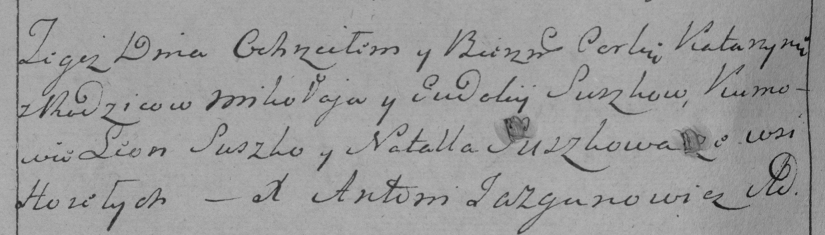

**Сушко Кацерына Микалаева (Suszkowna Katarzyna)**

2 ноября 1784 г -- крещение (РГИА 823-12-18, лист 227об, №24/1784-р
(коп)).

**РГИА 823-2-18:** Лист 227об. **Метрическая запись №24/1784-р (коп).**

Дедиловичская Покровская церковь. 2 ноября 1784 года. Метрическая запись
о крещении.

Suszkowna Katarzyna -- дочь родителей с деревни Горелое.

Suszko Mikołay -- отец.

Suszkowa Eudokija -- мать.

Suszko Leon -- кум.

Suszkowa Natalla - кума.

Jazgunowicz Antoni -- ксёндз.
