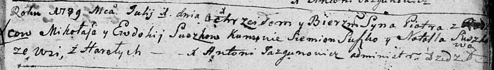

**Сушко Пётр Миколаев (Suszko Piotr)**

1 июля 1789 г -- крещение (НИАБ 136-13-894, лист 7, №33/1789-р (ориг)),
(РГИА 823-2-18, лист 238, №14/1789-р (коп)).

**НИАБ 136-13-894:** Лист 7. **Метрическая запись №33/1789-р (ориг).**

Дедиловичская Покровская церковь. 1 июля 1789 года. Метрическая запись о
крещении.

Suszko Piotr -- сын родителей с деревни Горелое.

Suszko Mikołaj -- отец.

Suszkowa Ewdokija -- мать.

Suszko Siemion - кум.

Suszkowa Natalla - кума.

Jazgunowicz Antoni -- ксёндз.

**РГИА 823-2-18:** Лист 238. **Метрическая запись №14/1789-р (коп).**

Дедиловичская Покровская церковь. 1 июля 1789 года. Метрическая запись о
крещении.

Suszko Piotr -- сын родителей с деревни Горелое.

Suszko Mikołay -- отец.

Suszko Eudokija -- мать.

Suszko Siemion -- кум.

Suszkowa Natalla - кума.

Jazgunowicz Antoni -- ксёндз.
