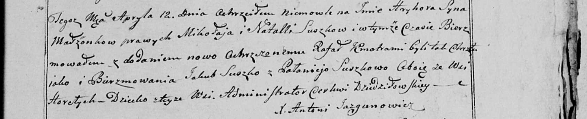

**Сушко Грыгор Миколаев (Suszko Grzegorz Rafal)**

9 апреля 1800 г -- крещение сына Грыгора Рафаля (НИАБ 136-13-894, лист
41, №13/1800-р (ориг), НИАБ 136-13-949, лист 102, №13/1800-р (коп)).

**НИАБ 136-13-894:** Лист 41. **Метрическая запись №13/1800-р (ориг).**

Дедиловичская Покровская церковь. 9 апреля 1800 года. Метрическая запись
о крещении.

Suszko Grzegorz Rafal -- сын родителей \[с деревни Горелое\].

Suszko Mikołay -- отец.

Suszkowa Natalla -- мать.

Suszko Jakub -- кум, с деревни Горелое.

Suszkowa Pałanieja -- кума, с деревни Горелое.

Jazgunowicz Antoni -- ксёндз.

**НИАБ 136-13-949:** Лист 102. **Метрическая запись №13/1800-р (коп).**

(См. тж.: НИАБ 136-13-894, лист 41, №13/1800-р (ориг))

Дедиловичская Покровская церковь. 12 апреля 1800 года. Метрическая
запись о крещении.

Suszko Hryhor Rafał -- сын родителей с деревни Горелое.

Suszko Mikołay -- отец.

Suszkowa Natalla -- мать.

Suszko Jakub -- кум, с деревни Горелое.

Suszkowa Pałanieja - кума, с деревни Горелое.

Jazgunowicz Antoni -- ксёндз.
