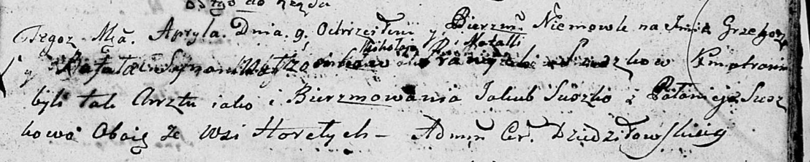

**Сушко Миколай (Suszko Mikołay)**

9 апреля 1800 г -- крещение сына Грыгора Рафаля (НИАБ 136-13-894, лист
41, №13/1800-р (ориг), НИАБ 136-13-949, лист 102, №13/1800-р (коп)).

26 августа 1801 г -- возможно, крестный отец Степана Андрея, сына Шил
Игната и Анастасии с деревни Горелое (НИАБ 136-13-894, лист 41,
№11/1800-р (ориг)).

16 марта 1802 г -- возможно, крестный отец Александра Антона, сына
Сушков Карпа и Марьяны с деревни Разлитье (НИАБ 136-13-894, лист 46,
№11/1802-р (ориг)).

17 апреля 1804 г -- возможно, крестный отец Сымона Яна, сына Рандаков
Данилы и Мелании с деревни Клинники (НИАБ 136-13-894, лист 53об,
№11/1804-р (ориг)).

**НИАБ 136-13-894:** Лист 41. **Метрическая запись №13/1800-р (ориг).**

Дедиловичская Покровская церковь. 9 апреля 1800 года. Метрическая запись
о крещении.

Suszko Grzegorz Rafal -- сын родителей \[с деревни Горелое\].

Suszko Mikołay -- отец.

Suszkowa Natalla -- мать.

Suszko Jakub -- кум, с деревни Горелое.

Suszkowa Pałanieja -- кума, с деревни Горелое.

Jazgunowicz Antoni -- ксёндз.

**НИАБ 136-13-949:** Лист 102. **Метрическая запись №13/1800-р (коп).**

(См. тж.: НИАБ 136-13-894, лист 41, №13/1800-р (ориг))

Дедиловичская Покровская церковь. 12 апреля 1800 года. Метрическая
запись о крещении.

Suszko Hryhor Rafał -- сын родителей с деревни Горелое.

Suszko Mikołay -- отец.

Suszkowa Natalla -- мать.

Suszko Jakub -- кум, с деревни Горелое.

Suszkowa Pałanieja - кума, с деревни Горелое.

Jazgunowicz Antoni -- ксёндз.

**НИАБ 136-13-894:** Лист 44. **Метрическая запись №20/1801-р (ориг).**

Дедиловичская Покровская церковь. 26 августа 1801 года. Метрическая
запись о крещении.

Szyło Stefan Andrzey -- сын родителей с деревни Горелое.

Szyło Jhnat -- отец.

Szyłowa Anastazyja -- мать.

Suszko Mikołay -- кум, с деревни Горелое.

Suszkowa Daryia -- кума, с деревни Горелое.

Jazgunowicz Antoni -- ксёндз.

**НИАБ 136-13-894:** Лист 46. **Метрическая запись №11/1802-р (ориг).**

Дедиловичская Покровская церковь. 16 марта 1802 года. Метрическая запись
о крещении.

Suszko Alexander Antoni -- сын родителей с деревни Разлитье.

Suszko Karp -- отец.

Suszkowa Marjana -- мать.

Suszko Mikołay -- кум, с деревни Горелое.

Suszkowa Ahapa -- кума, с деревни Разлитье.

Jazgunowicz Antoni -- ксёндз.

**НИАБ 136-13-894:** Лист 53об. **Метрическая запись №11/1804-р
(ориг).**

Дедиловичская Покровская церковь. 17 апреля 1804 года. Метрическая
запись о крещении.

Randak Symeon Jan -- дочь родителей с деревни Клинники.

Randak Daniła -- отец.

Randakowa Melanija -- мать.

Suszko Mikołay -- кум, с деревни Горелое.

Szuszkowa Pałanieja -- кума, с деревни Осовo.

Jazgunowicz Antoni -- ксёндз.
