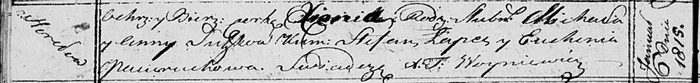

**Сушко Анна (Suszkowa Anna)**

6 января 1815 г -- крещение дочери Ксени (НИАБ 136-13-894, лист 91об,
№2/1815-р (ориг)).

**НИАБ 136-13-894:** Лист 91об. **Метрическая запись №2/1815-р (ориг).**

{width="6.496527777777778in"
height="0.7737631233595801in"}

Осовская Покровская церковь. 6 января 1815 года. Метрическая запись о
крещении.

Suszkowna Xienia -- дочь родителей с деревни Горелое.

Suszko Michał -- отец.

Suszkowa Anna -- мать.

Łapeć Stefan -- кум.

Paciaruchowa Euhenia -- кума.

Woyniewicz Tomasz -- ксёндз.
